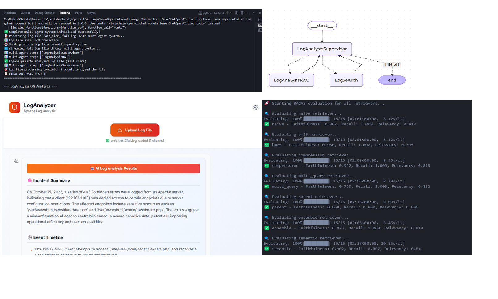

# 🚀 Multi-Agent Log Analyzer

An AI-powered Apache log analysis system using multi-agent architecture with LangGraph, featuring intelligent routing between specialized agents for comprehensive log analysis.

## 🎯 **Overview**

This project implements a sophisticated log analysis system that combines:
- **Multi-agent architecture** with intelligent routing
- **External search integration** for unknown errors
- **Internal knowledge base** for known incidents
- **Real-time analysis** with streaming responses
- **Professional SRE-focused output** with actionable insights

## 🖼️ Project Visuals



## 🏗️ **Architecture**

```
┌─────────────────┐    ┌──────────────────┐    ┌─────────────────┐
│   Next.js       │    │   FastAPI        │    │   Multi-Agent   │
│   Frontend      │◄──►│   Backend        │◄──►│   System        │
│                 │    │                  │    │                 │
│ • File Upload   │    │ • API Endpoints  │    │ • LogSearch     │
│ • Analysis UI   │    │ • Multi-Agent    │    │ • LogAnalysisRAG│
│ • Real-time     │    │ • Streaming      │    │ • Supervisor    │
│   Results       │    │ • Validation     │    │ • Routing       │
└─────────────────┘    └──────────────────┘    └─────────────────┘
```

## 🧠 **Multi-Agent System**

### **LogSearch Agent**
- **Purpose**: Handles unknown error codes and new issues
- **Tools**: Tavily external search integration
- **Use Case**: Finds up-to-date solutions from web resources

### **LogAnalysisRAG Agent**
- **Purpose**: Analyzes known Apache errors using internal knowledge
- **Tools**: Curated incident knowledge base
- **Use Case**: Provides detailed analysis from past incidents

### **Supervisor Agent**
- **Purpose**: Intelligent routing between agents
- **Logic**: Routes based on error type and availability of knowledge

## 🚀 **Quick Start**

### **Prerequisites**
- Python 3.11+
- Node.js 18+
- OpenAI API Key
- Tavily API Key (optional, for external search)

### **Installation**

1. **Clone the repository**
```bash
git clone https://github.com/chandana999/AIE8.git
cd AIE8
```

2. **Set up Backend**
```bash
cd backend
pip install -r requirements.txt
python app.py
```

3. **Set up Frontend**
```bash
cd frontend
npm install
npm run dev
```

4. **Access the application**
- Frontend: http://localhost:3000
- Backend API: http://localhost:8000
- API Docs: http://localhost:8000/docs

## 📁 **Project Structure**

```
├── backend/                 # FastAPI backend
│   ├── app.py              # Main application
│   ├── requirements.txt    # Python dependencies
│   └── .env.example       # Environment variables template
├── frontend/               # Next.js frontend
│   ├── app/               # App router pages
│   ├── package.json       # Node.js dependencies
│   └── tailwind.config.js # Styling configuration
├── data/                   # Knowledge base and samples
│   ├── web_incidents/     # Incident documentation
│   └── web_log_scenarios/ # Sample log files
└── web_log_analysis_demo.ipynb # Development notebook
```

## 🎯 **Features**

### **Core Functionality**
- ✅ **Multi-agent log analysis** with intelligent routing
- ✅ **File validation** with content-based detection
- ✅ **Real-time streaming** responses
- ✅ **External search integration** for unknown errors
- ✅ **Internal knowledge base** for known incidents

### **Analysis Output**
- 🧠 **Incident Summary** with severity assessment
- 🕒 **Event Timeline** with chronological flow
- ⚙️ **Root Cause Analysis** with causal chains
- 🚑 **Immediate Remediation** with actionable steps
- 🧱 **Prevention Recommendations** for long-term fixes

### **Technical Features**
- 🔄 **Streaming responses** for real-time feedback
- 🎯 **Smart error classification** and routing
- 📚 **Knowledge base integration** with RAG
- 🔍 **External search** with Tavily API
- 🛡️ **Input validation** and error handling

## 🚀 **Deployment**

### **Backend (Render)**
- Connect GitHub repository to Render
- Set environment variables (API keys)
- Auto-deploy on git push

### **Frontend (Vercel)**
- Connect GitHub repository to Vercel
- Set environment variables
- Auto-deploy on git push

## 📊 **Supported Log Types**

- **Apache Error Logs** (403, 502, 503, 504, SSL errors)
- **Access Logs** with HTTP requests
- **Custom Error Codes** (routed to external search)
- **System Logs** with timestamps and error patterns

## 🤝 **Contributing**

1. Fork the repository
2. Create a feature branch: `git checkout -b feature/amazing-feature`
3. Commit your changes: `git commit -m 'Add amazing feature'`
4. Push to the branch: `git push origin feature/amazing-feature`
5. Open a Pull Request

## 📄 **License**

This project is part of the AI Engineering Bootcamp curriculum.

## 🙏 **Acknowledgments**

- Built with [LangChain](https://langchain.com/) and [LangGraph](https://langchain.com/langgraph)
- External search powered by [Tavily](https://tavily.com/)
- Frontend built with [Next.js](https://nextjs.org/)
- Backend built with [FastAPI](https://fastapi.tiangolo.com/)

---

**Built with ❤️ for the AI Engineering community**
