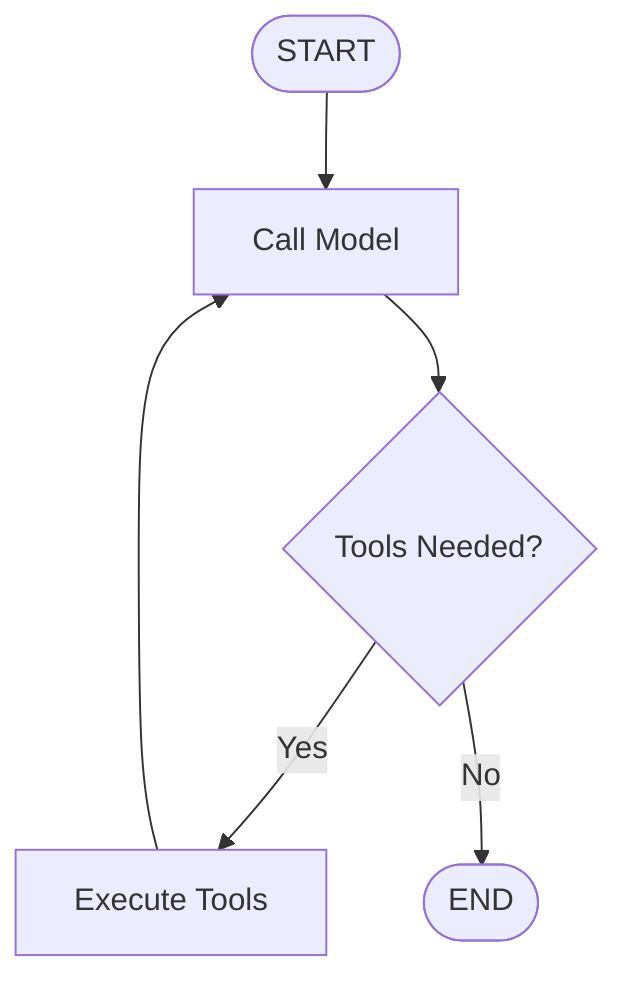

# LangGraph MCP Tools - Optimized & Modular

This project demonstrates how to integrate MCP (Model Context Protocol) servers with LangGraph workflows in a clean, modular, and optimized way.

## 📁 Project Structure

```
AIE8-MCP-Session/
├── server.py                    # MCP server with tools
├── langgraph_tools.py          # Original implementation
├── langgraph_clean.py          # ✨ Optimized modular version
├── langgraph_tools_optimized.py # Full-featured modular version
├── config.py                   # Configuration settings
├── utils.py                    # Utility functions
├── dice_roller.py              # Dice rolling utility
├── test-network.py             # Simple MCP client test
└── .env                        # Environment variables
```

## 🚀 Quick Start

1. **Install dependencies:**
   ```bash
   uv sync
   ```

2. **Set up environment variables in `.env`:**
   ```
   TAVILY_API_KEY="your-tavily-key"
   UNWIRED_API_KEY="your-unwired-key"
   OPENAI_API_KEY="your-openai-key"
   ```

3. **Run the optimized version:**
   ```bash
   uv run python langgraph_clean.py
   ```

## 🎨 Mermaid Diagram Support

The optimized version includes built-in Mermaid diagram generation for LangGraph workflows:



### How to View Diagrams:

1. **Online:** Copy the diagram code to [mermaid.live](https://mermaid.live/)
2. **Markdown:** Use ````mermaid` code blocks
3. **VS Code:** Install Mermaid extension

## 🔧 Key Optimizations

### 1. **Modular Architecture**
- **`config.py`**: Centralized configuration
- **`utils.py`**: Reusable utility functions
- **`langgraph_clean.py`**: Clean, focused main application

### 2. **Better Error Handling**
- Graceful error handling for MCP connections
- API error management
- Environment validation

### 3. **Improved Organization**
- Single responsibility classes
- Clear separation of concerns
- Easy to extend and maintain

### 4. **Enhanced Features**
- Rate limiting between queries
- Graph visualization
- Better logging and output formatting

## 🛠️ Available Tools

The MCP server provides three tools:

1. **`web_search`**: Search the web using Tavily API
2. **`roll_dice`**: Roll dice with custom notation (e.g., 2d20, 3d6k2)
3. **`get_cell_location`**: Get cell tower location using Unwired Labs API

## 📊 Workflow Flow

1. **Initialize**: Load environment, setup MCP client, discover tools
2. **Build Graph**: Create LangGraph workflow with model and tools
3. **Process Queries**: Route queries through the graph
4. **Execute Tools**: Call appropriate MCP tools when needed
5. **Return Response**: Format and return results

## 🔄 Usage Examples

### Basic Usage
```python
from langgraph_clean import LangGraphMCPApp

app = LangGraphMCPApp()
await app.initialize()
await app.run_demo()
```

### Custom Queries
```python
custom_queries = [
    "What's the weather like today?",
    "Roll 4d6 and keep the highest 3",
    "Find cell tower location for MCC 310, MNC 404"
]
await app.run_demo(custom_queries)
```

## 🎯 Benefits of Modular Design

1. **Maintainability**: Easy to modify individual components
2. **Testability**: Each module can be tested independently
3. **Reusability**: Components can be reused across projects
4. **Scalability**: Easy to add new tools or modify workflows
5. **Readability**: Clear structure and documentation

## 🚀 Running Different Versions

- **`langgraph_clean.py`**: Recommended - clean and optimized
- **`langgraph_tools_optimized.py`**: Full-featured with all classes
- **`langgraph_tools.py`**: Original implementation
- **`test-network.py`**: Simple MCP client test

Choose the version that best fits your needs!
